# Vigil

**Explainable airspace triage for the PHL area.**

**Live at <https://garishay.github.io/vigil/>** — the default recording; the evening arrivals bank
is [`?recording=vigil-phl-002`](https://garishay.github.io/vigil/?recording=vigil-phl-002). Open
one, press Play, read the Queue. Every merge to `main` redeploys it.

The operator study’s scenarios open by name (S3b): **Study-02a-vigil**
[`?feed=recording:vigil-phl-002&scenario=02a`](https://garishay.github.io/vigil/?feed=recording:vigil-phl-002&scenario=02a) ·
**Demo-02a-vigil** [`?recording=vigil-phl-002&scenario=02a`](https://garishay.github.io/vigil/?recording=vigil-phl-002&scenario=02a) ·
**Study-02b-vigil** [`?feed=recording:vigil-phl-002&scenario=02b`](https://garishay.github.io/vigil/?feed=recording:vigil-phl-002&scenario=02b) ·
**Demo-02b-vigil** [`?recording=vigil-phl-002&scenario=02b`](https://garishay.github.io/vigil/?recording=vigil-phl-002&scenario=02b).
The unaided condition (S4a): **Study-02a-raw**
[`?feed=recording:vigil-phl-002&scenario=02a&mode=raw`](https://garishay.github.io/vigil/?feed=recording:vigil-phl-002&scenario=02a&mode=raw) ·
**Study-02b-raw** [`?feed=recording:vigil-phl-002&scenario=02b&mode=raw`](https://garishay.github.io/vigil/?feed=recording:vigil-phl-002&scenario=02b&mode=raw).
The prioritization pair (S7): **Study-03a-vigil**
[`?feed=recording:vigil-phl-002&scenario=03a`](https://garishay.github.io/vigil/?feed=recording:vigil-phl-002&scenario=03a) ·
**Study-03a-raw** [`?feed=recording:vigil-phl-002&scenario=03a&mode=raw`](https://garishay.github.io/vigil/?feed=recording:vigil-phl-002&scenario=03a&mode=raw) ·
**Study-03b-vigil** [`?feed=recording:vigil-phl-002&scenario=03b`](https://garishay.github.io/vigil/?feed=recording:vigil-phl-002&scenario=03b) ·
**Study-03b-raw** [`?feed=recording:vigil-phl-002&scenario=03b&mode=raw`](https://garishay.github.io/vigil/?feed=recording:vigil-phl-002&scenario=03b&mode=raw) ·
**Demo-03a-vigil** [`?recording=vigil-phl-002&scenario=03a`](https://garishay.github.io/vigil/?recording=vigil-phl-002&scenario=03a) ·
**Demo-03b-vigil** [`?recording=vigil-phl-002&scenario=03b`](https://garishay.github.io/vigil/?recording=vigil-phl-002&scenario=03b);
a 03 run is as long as its scenario says — 3:38 on 03a, 2:59 on 03b — where a 02 run is six minutes.
`?scenario=on` is the default deal, `off` none; `?mode=vigil`, the default, is the app as built.
A **study run** (S4b) adds `&subject=<code>&run=<n>` to a study link, both or neither —
[`?feed=recording:vigil-phl-002&scenario=02a&mode=raw&subject=S03&run=1`](https://garishay.github.io/vigil/?feed=recording:vigil-phl-002&scenario=02a&mode=raw&subject=S03&run=1):
the brief, the scenario's minutes on the clock, the end screen with Copy run.

Vigil is an airspace-triage workstation for Philadelphia-area airspace. It fuses two layers into
one picture — real, publicly broadcast ADS-B traffic (the cooperative aircraft) and simulated
small-UAS tracks (the injects) — scores every track against a protected site using transparent,
inspectable logic, and presents a ranked queue so a watch officer always knows which track
deserves attention first, and exactly why.

Every score decomposes into visible factors. A ranked list nobody can interrogate is a liability.

---

## How it fits together

Two layers converge on one track model; pure modules do the work and the UI only consumes them.
The two scripts under `scripts/` run offline, once, and are the only boxes that do I/O without
a test seam. The app calls the modules; nothing calls back. The diagram draws the **data path,
not the import graph**: helper modules (`geo`, `rng`, `identity`) and type-only edges are
deliberately omitted. The shared track model is drawn as the hub on purpose — every stage meets
its contract there — and pure helpers (`display` included) fold into their consumers, as the
silhouettes fold into the drawer. Dashed boxes are later PRs; dashed edges are supporting
relationships — a startup fetch, a regeneration, a display lookup that fails soft — rather than
the runtime data path. The one runtime network call, the photo lookup, sits outside the pure
boundary and reaches nothing inside it.

```mermaid
flowchart LR
  subgraph offline["Offline, run once — network and filesystem, not a runtime module"]
    direction LR
    cap["scripts/capture-adsb.ts"] --> fx[("public/adsb-phl.json · adsb-phl-002.json<br/>the committed recordings")]
    fx --> goldgen["scripts/generate-inject-golden.ts<br/>npm run fixture:injects<br/>samples the plan at the recording's frame times"]
    tonegen["scripts/generate-tone.ts<br/>npm run fixture:tone<br/>the alert tone, synthesized — original and deterministic"] --> tone[("public/alert-tone.wav")]
    bench["scripts/bench.ts<br/>npm run bench · bench:baseline<br/>every recording × N seeds at one-second ticks, the engine through the app's own seams<br/>the generator's labels as the oracle · a config override for a sweep, printed, never written"] --> baseline[("docs/bench/baseline.md<br/>the scoreboard: crossings, ranks, flaps per behavior; real aircraft by uncapped band<br/>a test holds the default run to it byte for byte")]
    study["scripts/study.ts<br/>npm run bench:study<br/>the operator study's acceptance: each study scenario through the feed beside 002 over its own window<br/>02's four lines · 03's prioritization lines — the lock, the margins, the baits, the band rows, the rule · the cue audit on airborne ticks · above calm · flaps · pattern-kind changes · every ring entry — held byte for byte by test"] --> sb[("docs/bench/study-02a.md · study-02b.md · study-03a.md · study-03b.md")]
    fx --> study
    fx --> bench
    replaytool["tools/replay.ts + tools/replay/<br/>npm run replay · --study <dir> --out <dir><br/>the study's replay (S5): run JSON in, validated in so many words · the scenario regenerated from its seed at t + beginS through associate at the run's mode<br/>standoff at decision · time to escalate · miss · false escalations · looks · the study CSV (S5a)<br/>the frame per run (S5b): the picture at the freeze, the ring, the threat's trail, every look as a hop on the path, the analyst's never-opened overlay, the caption — identical in both modes; engine.ts scores a second as the bench does<br/>N threats from the bench's roles table (S5c-i): the window per scenario, the metrics per threat, the attention numbers — opened before the first threat, first open and standoff per threat, false escalations against later entrants, order — the frame per threat<br/>the Vigil annotations on a Vigil frame only (S5c-ii): the warm labels, the Queue box under the map, a threat's mismatch line and entry estimate, the caption's Vigil line per threat look — the app's readings through engine.ts · the pair with one row per threat and the study figure (S5d) follow"] --> studyout[("study/ — gitignored<br/>study.csv · one SVG per run · the fixtures under tools/replay/__fixtures__ are the only runs the repo holds")]
    fx --> replaytool
  end
  subgraph pure["Pure modules — no React, no DOM, no I/O in the scoring path; unit-tested directly"]
    direction LR
    subgraph real["Real layer — public ADS-B, cooperative by construction"]
      direction LR
      recs["config/recordings.ts<br/>the registry: id · file · clock start<br/>?recording=id selects one; 001 the default"] --> load
      load["data/capture.ts<br/>loadCapture: fetch once at startup, AO guard<br/>frameTracks"] --> norm["lib/adsb.ts<br/>toTrack: record → AdsbTrack<br/>identity is the literal 'cooperative'<br/>(normalizers run at capture time)"]
      norm --> replay["lib/replay.ts<br/>indexCapture → pictureAt(t): bracket by the track's own samples,<br/>interpolate, hold, coast then drop · memoryAt: identity memory as a fold over the frame grid<br/>historyAt / historiesAt(t): every track's position history — samples for an aircraft, grid instants for an inject —<br/>the map's trail at one window, the pattern detectors' input at another"]
      replaycfg["config/replay.ts<br/>coast window · tick"] --> replay
    end
    subgraph syn["Synthetic layer — 100% generated"]
      direction LR
      scenarios["config/scenarios.ts + scenarios/<br/>the registry: default · 02a · 02b · 03a · 03b, cast-only files, one row per entry · a study scenario's own run length<br/>cast.ts: nine builders over the three cast behaviors — threat · shuttle · silentMover · mover · hover · returning · silentHover · silentAt · silentOrbit"]
    cfg --> scenarios
    scenarios --> gen
    cfg["config/scenario.ts<br/>seed · envelope · launch points · the cast"] --> gen["lib/injects.ts<br/>planScenario → injectTracksAt(t)<br/>5 dealt behaviors · 3 cast behaviors, scripted · 3 Remote ID states · UA type"]
      gold[("lib/__fixtures__/injects-&lt;seed&gt;.json<br/>golden: same seed, same picture")]
    end
    ao["config/ao.ts<br/>AO: center · bbox · time zone · protected sites with their tier"]
    sites["lib/sites.ts<br/>the session's site set: protected sites and friendly launch areas<br/>add · update · remove · reset, stamped at sim time · the rules a site meets · the last protected site stays<br/>the site plan: JSON out, a pasted plan back in · restored from this browser's storage at load, held while the set differs from config"]
    model["lib/tracks.ts<br/>common Track model<br/>Cooperative / Non-cooperative / Unknown"]
    scorecfg["config/scoring.ts<br/>weights · curves · bands · ADS-B ceiling · operating hours · pattern numbers"]
    studycfg["config/study.ts<br/>Begin · the run's default length · the brief by run length · raw mode's association distance · the acceptance and audit numbers"]
    patterns["lib/patterns.ts<br/>loiter dwell · orbit · area revisit, over the position history<br/>positions only · the strongest is the factor · named past a threshold · the last leg under the floor dropped from the turn"]
    score["lib/scoring.ts<br/>six factors · identity memory · ADS-B ceiling · the friendly launch cap · closing on the projection's time to entry, complete inside the ring<br/>the site tier on the per-site value · the set as scored on the score<br/>per-factor breakdown retained · input type strips the answer key"]
    rank["lib/ranking.ts<br/>rank by composite, breakdown on the entry"]
    life["lib/lifecycle.ts<br/>§7.1 transition table + event log<br/>observed fields only — never the answer key<br/>band crossings, pattern changes, loss and return logged at sim time, statuses carried · re-surface read off the log<br/>the sites in force on every snapshot"]
    hand["lib/handoff.ts<br/>escalation summary as copyable text<br/>evidence block frozen at the escalate snapshot · the site line from the record · timeline live"]
    run["lib/run.ts<br/>the run JSON: subject · scenario · mode · run · build · began_at · events · answers<br/>the record's actions and the selections folded, t from Begin · track ids only — no position, no score, no name"]
    workcfg["config/contacts.ts + dispositions.ts<br/>recipients · outcome labels"]
    frames["config/airframes.ts<br/>emitter categories · type codes · kinematic envelope"]
    airframe["lib/airframe.ts<br/>classify: silhouette class + its basis<br/>type code → category → UA type → envelope"]
    replay --> model
    gen --> model
    gen -- trail instants --> replay
    ao --> gen
    ao --> score
    model --> score
    scorecfg --> score
    scorecfg --> patterns
    patterns --> score
    replay -- histories at t --> score
    replay -- origins: first sample, first frame --> score
    frames -- kinematic box --> score
    score --> rank
    recs -- the default's hour, for a caller without a clock --> rank
    model --> airframe
    frames --> airframe
    workcfg --> hand
    alertcfg["config/alerts.ts<br/>the triggers: warning · caution (off) · pattern · re-surface"]
    alerts["lib/alerts.ts<br/>a surface over the record: which entries earn a card, which clear one<br/>one pending card per track per kind · a tick raises, a seek replays · never a capped cooperative track"]
    alertcfg --> alerts
    life -- the log, entry by entry --> alerts
    life -- the record's actions --> run
    projcfg["config/projection.ts<br/>the horizon — the factor's entryZeroMin, one number"]
    proj["lib/projection.ts<br/>time to entry by dead reckoning: the observed position, track, and speed against every protected ring<br/>the soonest, its site named and tier carried · inside at zero · none past the horizon<br/>the entry point on the ring · the position's own age counted off, a coasting track captioned · entryAt: the one entry estimate the Closing factor scores and the Entry row prints (S3a)"]
    scorecfg -- entryZeroMin --> projcfg
    projcfg --> proj
    model --> proj
    proj -- the value on every snapshot --> life
    proj -- entryAt, per ring --> score
  end
  photos["data/photos.ts + usePhoto<br/>one photo per opened ADS-B track, by hex<br/>runtime lookup · session cache · fails soft to the silhouette"]
  fx -. fetched at startup .-> load
  gen --> goldgen
  goldgen -. pins .-> gold
  gen --> bench
  replay -- picture · memory · histories · origins at t --> bench
  score -- scoreTrack · bandOf --> bench
  studycfg --> study
  scenarios -- 02a · 02b through the feed --> study
  gen -- injectTracksAt, the feed over it --> study
  replay -- picture · memory · histories · origins at t --> study
  scenarios -- the run's scenario, planned on the recording's grid --> replaytool
  gen -- injectTracksAt, through associate at the run's mode --> replaytool
  replay -- pictureAt --> replaytool
  studycfg -- Begin · the run · raw's distance --> replaytool
  study -- the roles table: each cast's threats --> replaytool
  score -- scoreTrack · bandOf --> study
  rank -- queueOrder --> study
  proj -- entryAt --> study
  rank -- queueOrder --> bench
  ao -- bbox --> cap
  norm -. normalize + rate-limit etiquette, at capture time .-> cap
  subgraph ui["UI — React + MapLibre; consumes the modules, never reimplements them"]
    direction TB
    app["App.tsx + data/useCapture.ts<br/>loads the recording the query names, once<br/>holds the inject plan · samples both layers and every history at the clock's t<br/>opens a track's log when it first appears · sim clock ticking from the recording's clock start"]
    queue["Queue<br/>ranked list, the product · reason tag in plain English"]
    map["MapView + IdentityLegend<br/>context · breadcrumb trail behind the selected track · its projected path to the ring"]
    review["components/ReviewDrawer.tsx + TrackVisuals + ScoreBreakdown<br/>one track — observed or derived<br/>silhouette by class · photo, credited (ADS-B only) · selection synced with the map<br/>score opened to its factors, band-coloured · lifecycle actions · event log and handoff in sim time · trail count · time to entry"]
    clock["data/usePlayback.ts + Playback<br/>the replay clock: play · pause · seek, one second per tick · how it last moved<br/>a study run's window: held at Begin, ended at +6:00, never restarted<br/>scheduler injected, so no test waits on time"]
    panel["components/SitesPanel.tsx<br/>the Sites surface: protected sites and friendly launch areas as rows, the inline editor, placement armed on the map<br/>the site plan: copy out, load back · refused behind the record's frontier · a restored row reads stored"]
    copy["components/useCopy.ts<br/>copy with the clipboard, fall back to the textarea's selection<br/>'Copied' only for the text actually copied"]
    copy -- handoff --> review
    copy -- site plan --> panel
    stack["components/AlertStack.tsx<br/>the cards over the map, newest first · the body selects the track<br/>Acknowledge, refused behind the track's frontier"]
    app --> queue
    app --> map
    app -- cards · the clock's last move --> stack
    sound["components/useAlertTone.ts<br/>one audio element for the session, played once per raise batch · muted from the strip"]
    app -- a raise batch · mute --> sound
    app -- selected track: drawer --> review
    app -- site set · placing --> panel
    clock -- t --> app
  end
  model -- adsb + injects: map, strip --> app
  ao -- center · zoom · basemap: map, strip · default sites --> app
  sites -- session set: scorer, map, panel --> app
  cfg -- seed: strip --> app
  recs -- ?recording= selection · the default --> app
  scenarios -- ?scenario= name · on the first · off none · a run's length --> app
  studycfg -- ?mode=raw: the rule at 1 500 m, every derived reading hidden · a run: Begin · the window · the brief · the questions --> app
  run -- the run JSON: the end screen's Copy run --> app
  rank -- ranked + scores: queue chip, drawer, handoff, snapshot, map fill --> app
  life -- log · status · re-surface: drawer, state filter, row --> app
  proj -- time to entry for the selected track: drawer, map line --> app
  alerts -- the stack, folded from each track's new entries --> app
  workcfg -- pickers: drawer --> app
  hand -- handoff text --> review
  airframe -- class · basis: visuals --> review
  photos -. fetched on open .-> review
  tone -. fetched on the first raise .-> sound
```



---

## ⚠️ Guardrails (non-negotiable)

These are the rules this project is built under. They are not aspirational — they constrain every
PR, and `CLAUDE.md` carries them so the AI agent enforces them too.

- **Public or synthetic data only.** The real layer is ADS-B — broadcast in the clear by aircraft
  and freely rebroadcast by community aggregators. The threat layer is 100% generated. Nothing
  observed, recorded, or derived from any work system ever enters this repo.
- **Real aircraft are never the threat.** By design, any track sourced from ADS-B is treated as
  cooperative and receives low baseline priority. Only synthetic injects can score as threats.
  This is both an ethics rule and a product truth — broadcasting your position is the defining
  cooperative act. Vigil also never singles out specific individuals' aircraft: no VIP or
  celebrity tracking. Real tracks receive special attention only for assistance signals they
  broadcast themselves.
- **Public first principles only.** Design draws exclusively on open literature: CPA/TCPA
  geometry, published counter-UAS concepts, FAA Remote ID as public context. No proprietary or
  employer requirements, terminology, code, or documents. If a design question can only be
  answered from work knowledge, a different design gets picked.
- **Not an operational system.** Vigil is an **educational demonstration**. It is **not for
  operational use**, and it makes **no claims about real-world threat assessment**. Nothing here
  should be relied upon for safety-of-life or security decisions.
- **No simulated engagement.** Vigil never models jamming, takeover, or kinetic defeat. Its act
  step ends at assessment and notification — which is both the ethics posture and the watch
  floor's actual job under the current US domestic framework.
- **Public repo from day one.** Openness is the enforcement mechanism.

---

## Status

Phase 1 — frontend stub. See [`docs/mvp-scope.md`](docs/mvp-scope.md) for the full MVP scope,
the scoring model, the PR sequence, and the process contract.

## Stack

Vite · React · TypeScript · MapLibre GL · Vitest · ESLint · Prettier

Basemap: CARTO Dark Matter — © CARTO, © OpenStreetMap contributors — the attribution the map
itself draws.

## Commands

```bash
npm install       # install dependencies
npm run dev       # start the dev server
npm run build     # production build
npm run lint      # ESLint
npm run typecheck # tsc --noEmit
npm run test      # Vitest
npm run replay -- --study <dir>   # the study's metrics CSV from run JSON files (S5a); study/ by default
```

### The study's replay (S5)

A run JSON — what **Copy run** hands back at the end of a study run — goes in; the study's
numbers come out, offline, the scenario regenerated from its seed on the study recording's own
frame grid through the app's pure modules. `npm run replay -- <run.json> …` prints the CSV for
those runs; `npm run replay -- --study <dir> [--out <dir>]` writes `study.csv` for every `.json`
file in the directory under `study/` at the repo root, which is gitignored: the eight fixtures
under `tools/replay/__fixtures__/` — the corroboration pair's four and the prioritization pair's
four — are the only runs the repo holds. A file that is not a run is refused with its path and
the field. The bare form also writes each run's **frame** beside the CSV —
`<subject>-<scenario>-<mode>-<run>.svg`, the picture at the moment of escalation with every look
as a numbered hop on its path, each threat's trail and ring entry, and the analyst's
_never opened_ overlay, drawn identically in both conditions (S5b). The threats are the bench's
roles table (`scripts/study.ts`), one on 02a and 02b, two on 03a and 03b; a 03 run's CSV row
carries the attention numbers beside the standoff — the non-threats opened before any threat, each
threat's first open and standoff, the false escalations (tracks that never enter the ring, and any real aircraft) and the
escalations of later entrants on their own column, the order — and its frame freezes at the last
threat's escalation with one decision line per threat (S5c-i). A Vigil run's frame carries what
Vigil's screen showed and raw's did not (S5c-ii): the warm labels beside every above-calm
inject, the Queue box under the map with every candidate's rank, composite, and reason tag, a
threat's Remote ID mismatch line where its score read one, the Entry row's estimate beside each
threat's dot, and after each threat look the caption's line of what Vigil read then — the app's
own readings through the engine, every element gated on the mode so a raw frame is byte for byte
as before. On the prioritization pair each threat carries one map label per mode and the T0
range and entry clock move into the caption. The paired frame with one row per threat and the
study figure follow in S5d.

## How this repo is built

Every change ships through the same path: GitHub Issue with a mini-PRD → branch → PR → AI code
review → green CI → engineering review → iteration → squash-merge. The path is deliberate — it
is half the point of the project.
