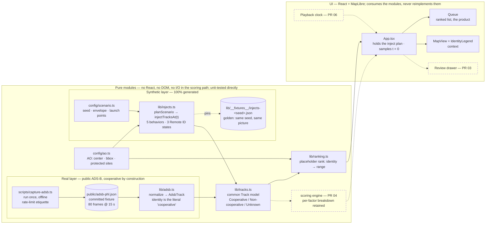

# Vigil

**Explainable airspace triage for the PHL area.**

Vigil is an airspace-triage workstation for Philadelphia-area airspace. It fuses two layers into
one picture — real, publicly broadcast ADS-B traffic (the cooperative aircraft) and simulated
small-UAS tracks (the injects) — scores every track against a protected site using transparent,
inspectable logic, and presents a ranked queue so a watch officer always knows which track
deserves attention first, and exactly why.

Every score decomposes into visible factors. A ranked list nobody can interrogate is a liability.

---

## How it fits together

Two layers converge on one track model; pure modules do the work and the UI only consumes them.
Dashed boxes are later PRs.



---

## ⚠️ Guardrails (non-negotiable)

These are the rules this project is built under. They are not aspirational — they constrain every
PR, and `CLAUDE.md` carries them so the AI agent enforces them too.

- **Public or synthetic data only.** The real layer is ADS-B — broadcast in the clear by aircraft
  and freely rebroadcast by community aggregators. The threat layer is 100% generated. Nothing
  observed, recorded, or derived from any work system ever enters this repo.
- **Real aircraft are never the threat.** By design, any track sourced from ADS-B is treated as
  cooperative and receives low baseline priority. Only synthetic injects can score as threats.
  This is both an ethics rule and a product truth — broadcasting your position is the defining
  cooperative act. Vigil also never singles out specific individuals' aircraft: no VIP or
  celebrity tracking. Real tracks receive special attention only for assistance signals they
  broadcast themselves.
- **Public first principles only.** Design draws exclusively on open literature: CPA/TCPA
  geometry, published counter-UAS concepts, FAA Remote ID as public context. No proprietary or
  employer requirements, terminology, code, or documents. If a design question can only be
  answered from work knowledge, a different design gets picked.
- **Not an operational system.** Vigil is an **educational demonstration**. It is **not for
  operational use**, and it makes **no claims about real-world threat assessment**. Nothing here
  should be relied upon for safety-of-life or security decisions.
- **No simulated engagement.** Vigil never models jamming, takeover, or kinetic defeat. Its act
  step ends at assessment and notification — which is both the ethics posture and the watch
  floor's actual job under the current US domestic framework.
- **Public repo from day one.** Openness is the enforcement mechanism.

---

## Status

Phase 1 — frontend stub. See [`docs/mvp-scope.md`](docs/mvp-scope.md) for the full MVP scope,
the scoring model, the PR sequence, and the process contract.

## Stack

Vite · React · TypeScript · MapLibre GL · Vitest · ESLint · Prettier

## Commands

```bash
npm install       # install dependencies
npm run dev       # start the dev server
npm run build     # production build
npm run lint      # ESLint
npm run typecheck # tsc --noEmit
npm run test      # Vitest
```

## How this repo is built

Every change ships through the same path: GitHub Issue with a mini-PRD → branch → PR → AI code
review → green CI → engineering review → iteration → squash-merge. The path is deliberate — it
is half the point of the project.
